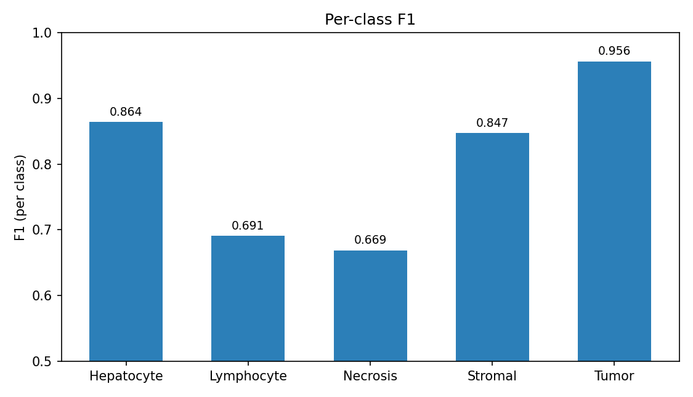
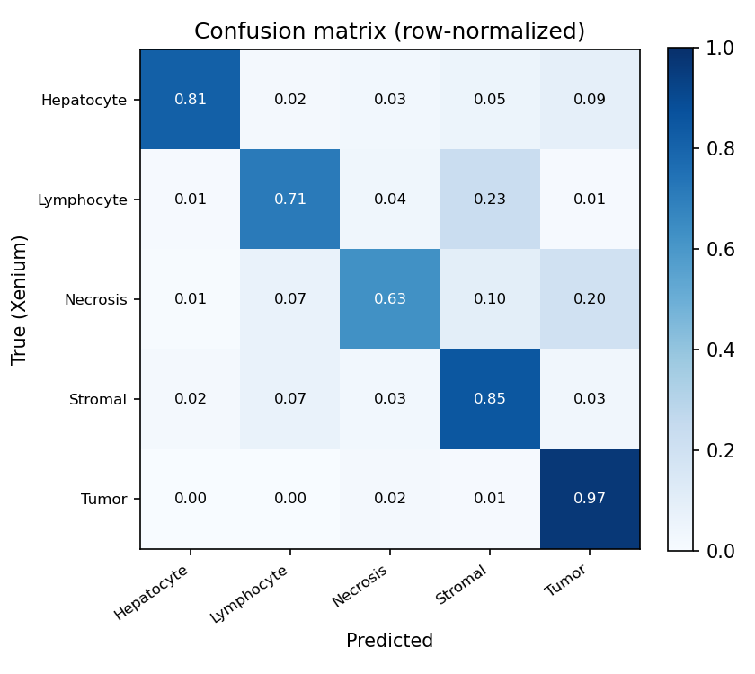

# HECell

Cell-type classification on H&E histology, supervised by paired Xenium spatial transcriptomics.

HECell assigns a cell type to every cell in an H&E whole-slide image of metastatic colorectal cancer (mCRC) liver tissue. Labels are transferred from a paired Xenium spatial-transcriptomics run onto the H&E during training; at inference the model uses H&E alone. Cell types: **Hepatocyte, Lymphocyte, Necrosis, Stromal, Tumor**.

## Background

Routine H&E staining is cheap and available at scale, but H&E alone does not resolve cell identity the way molecular assays do. Xenium spatial transcriptomics segments individual cells and measures their gene expression in situ, which assigns each cell a defensible molecular type. HECell transfers that supervision onto the image: the H&E is registered into the Xenium coordinate frame, the Xenium-derived labels are carried onto the aligned H&E cells, and an image model is trained to reproduce them. The model then classifies cells from morphology alone.

## Method

Per-cell image features are produced by a pathology foundation model and feed a supervised classifier trained against the Xenium-derived labels. The backbone can be used frozen or LoRA-fine-tuned. Performance is measured by patient-stratified 5-fold cross-validation: folds are grouped by patient, so no patient appears in both train and test.

## Results

HECell on the mCRC cohort, evaluated by patient-stratified cross-validation (manuscript in preparation):

| Metric | Value |
|---|---|
| Macro-F1 | **0.8054** |
| Macro-AUC | 0.967 |

| Class | F1 |
|---|---|
| Tumor | 0.956 |
| Hepatocyte | 0.864 |
| Stromal | 0.847 |
| Lymphocyte | 0.691 |
| Necrosis | 0.669 |




## What is in this repository

This repository contains the HECell pipeline: data preparation, feature extraction, training, evaluation, and inference.

```
HECell/
├── README.md
├── requirements.txt
├── LICENSE
├── configs/
│   └── baseline.yaml         # classes, scale, folds, training hyper-parameters
├── src/
│   ├── config.py             # paths and config loading
│   ├── crops.py              # H&E crop utilities
│   ├── backbone.py           # load a timm backbone
│   ├── build_cell_table.py   # Xenium -> per-cell table (coords + labels)
│   ├── train_lora.py         # optional: LoRA fine-tune the backbone
│   ├── extract_features.py   # per-cell features (frozen or LoRA-adapted)
│   ├── data.py               # feature/label assembly + patient-grouped folds
│   ├── model.py              # MLP classifier
│   ├── train.py              # 5-fold patient-stratified CV; saves OOF preds + checkpoints
│   ├── evaluate.py           # metrics + plots from the out-of-fold predictions
│   └── predict.py            # apply a trained fold to a sample's features
└── docs/figures/             # result plots
```

No images, Xenium data, labels, or model weights are included.

## Quick start

```bash
python -m venv .venv && source .venv/bin/activate
pip install -r requirements.txt

export HECELL_ROOT=/path/to/hecell      # data/ and outputs/ live under it

python src/build_cell_table.py                     # Xenium -> per-cell table
python src/extract_features.py --backbone <timm-model-name>   # add --weights <ckpt> for a local backbone

# optional: LoRA fine-tune the backbone, then extract from the adapted model
python src/train_lora.py --groups groups.csv --backbone <timm-model-name>
python src/extract_features.py --backbone <timm-model-name> --lora outputs/lora

python src/train.py --groups groups.csv            # 5-fold CV; groups.csv: sample, patient
python src/evaluate.py                             # metrics + figures -> outputs/
python src/predict.py --sample <name> --model outputs/models/fold0.pt
```

Expected inputs are documented in each script's header.

## License & citation

Provided for transparency; see `LICENSE`. Manuscript in preparation; citation details will be added on publication.
